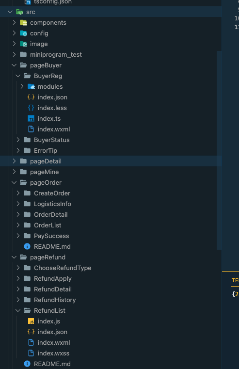

# Wx2Taro
wx 小程序代码转换为 taro 代码，[实现原理](./assets//principle.md)


## 本地开发
安装依赖，不建议使用 npm 或者 yarn
```sh
pnpm i
```

## 本地调试

```sh
// link 到全局 node_modules
pnpm link --global

// watch 文件
npm run dev

// 调试
wx2taro 
```

## 在需要转换的小程序仓库进行配置
在需要转换的小程序仓库 package.json 中进行配置

```json
{
    ...,
    "wx2Taro":{
        "entry":"xx",
        "output":"xx"
    }
}
```

|配置名字|含义|是否必填|
|-------|---|-------|
|wx2Taro.entry|需要转换的目录|否|
|wx2Taro.output|输出的目录|是|

## 执行命令
```sh
// xxx 目录下必须满足小程序的格式，包含4个文件，xxx.json,xxx.less,xxx.ts,xxx.wxml
wx2taro xxx目录
```

通过如上的命令就可以编译 xxx 目录下的小程序代码，并输出到 wx2taro.output 配置的taro仓库目录下

举个例子，我们想编译 BuyerReg 目录
**注意：wx2taro 只会读取目录下的 xxx.json 并找到同名的 xxx.less,xxx.ts,xxx.wxml 进行编译**



首先，我们在 package.json 中配置目录
```json
{
    ...,
    "wx2Taro":{
        "output":"../taro-tlz-buy"
    }
}
```

那我们可以通过执行
```sh
wx2taro /src/pageBuyer/BuyerReg
```

输出成功后，会在 ../taro-tlz-buy/src/pageBuyer/BuyerReg 生成转换后的 tsx 代码和 less 代码

我们也可以通过配置 entry 省略 src 目录，如下

```sh
{
    ...,
    "wx2Taro":{
        "entry":"./src",
        "output":"../taro-tlz-buy"
    }
}
```

配置后我们只需要执行如下命令就可转换代码

```sh
wx2taro /pageBuyer/BuyerReg
```


