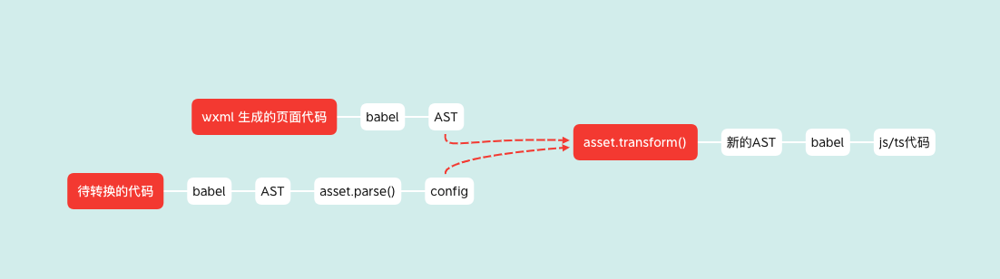

# 小程序代码转 Taro 代码编译工具 Wx2Taro 的原理及实现

## 背景
公司由于业务调整，原有的小程序要增加 Web 版，由于它们的技术栈并不相同，因此每个需求都得二次开发，成本是极高的</br>
因此，我们迫切需要一种跨端的技术方案，写一份代码，编译到多个端，经过调研，我们采用了社区内广为流行的 Taro，建立了跨端开发体系</br>
使用了 Taro 以后，新的业务，我们可以直接采用 Taro 编写，但是对于一些原有小程序的业务，如何快速移植到 Taro 上来呢？</br>
Wx2Taro 应运而生，通过这个工具，将微信小程序代码通过命令直接转换为 Taro 代码，帮助我们快速将老的业务迁移到新的开发体系上


## 实现
无论是小程序代码，还是 Taro 代码，它都是通过特定的语法去描述一套逻辑，wx2Taro 最核心的事情，就是去理解小程序描述的逻辑，然后将这套逻辑抽象出来，再通过 Taro  代码“翻译”出来</br>
AST（抽象语法树）很适合做这个中间桥梁，去抽象地描述逻辑</br>
一个页面的小程序代码分成 4 块，针对每一块，我们都需要转换为相应的 AST，在通过 AST 转换为 Taro 代码

- js/ts：   页面逻辑
- wxml：  页面布局，排版
- wxss：  页面 样式
- config：页面的一些配置

## 整体方案


### WXML
整个编译过程分为**词法分析，语法分析，格式化，出码阶段**

#### 词法分析
将一个个字符串解析成一个个词法单元 token，并生成 token 队列，token 的类型定义如下：
```ts
/** 节点类型 */
export enum Type {
  /** 文本节点 */
  Text = 'text',
  /** 注释 */
  Comment = 'comment',
  /** tag 开始 */
  TagStart = 'tag-start',
  /** tag 结束 */
  TagEnd = 'tag-end',
  /** Tag 标签 */
  Tag = 'tag',
  /** 属性 */
  Attribute = 'attribute',
  /** 元素 */
  Element = 'element'
}
 
/** 位置信息 */
export interface Position {
  index: number
  column: number
  line: number
}
 
/** 词法分析单元 */
export interface Token {
  /** 类型 */
  type: Type
  /** 内容 */
  content?: string
  /** 是否关闭 */
  close?: boolean
  /** 位置 */
  position?: {
    start?: Position
    end?: Position
  }
}
```

#### 语法分析
遍历 token 队列，生成 wxml 的语法树，语法树的结构如下，他是一个树形结构，映射 wxml 的语法
```ts
export interface TextNode {
  type: Type.Text
  content: string
  position: {
    start: Position
    end: Position
  }
}
 
export interface CommentNode {
  type: Type.Comment
  content: string
  position: {
    start: Position
    end: Position
  }
}
 
export interface ElementNode {
  type: Type.Element
  tagName: string
  attributes: string[]
  children: Node[]
  position: {
    start: Position
    end: Position
  }
}
 
export type Node = ElementNode | TextNode | CommentNode
 
/** 栈节点 */
export interface StackNode {
  tagName: string
  children: Node[]
  position?: {
    start?: Position
    end?: Position
  }
}
```

#### 格式化
经过语法分析后生成的语法树比较粗糙，如对于 wxml 的属性，就是一个个 `key1=value1,key2 = value2`的字符串，因此我们要对这棵树型进行“修饰”，修成一棵更易于解析的树。
格式化的过程很简单，对语法树进行深度优先遍历，代码如下：

```ts
function formatAttributes(attributes: string[]) {
  return attributes.reduce((pre, attribute) => {
    const parts = attribute.trim().match(/^([^=]+)=(.+)$/)
 
    let key = ''
    let value: string | boolean = ''
    if (parts?.length === 3) {
      key = parts[1]
      value = typeof parts[2] === 'string' ? unquote(parts[2]) : null
    } else {
      // boolean 型的属性
      key = attribute
      value = true
    }
 
    return {
      ...pre,
      [key]: value
    }
  }, {})
}
 
export default function format(nodes: Node[]) {
  return nodes.map((node) => {
    const returnNode: ASTNode = node.type === Type.Element ? {
      type: node.type,
      tagName: node.tagName,
      attributes: formatAttributes(node.attributes),
      children: format(node.children),
      position: node.position
    } : {
      type: node.type,
      content: node.content,
      position: node.position
    }
 
    return returnNode
  })
}
```

### 生成代码
有了格式化后完备的语法树后，我们就可以解析这棵树，生成 jsx 的语法，每个节点包含标签，属性，子节点等，由于 wxml 的属性，内容中包含特殊语法，如循环渲染，条件渲染，变量渲染，事件绑定等，因此我们读取节点的属性时，遇到这些带逻辑的属性，要进行区别处理，对各种指令的处理
```ts
/**
 * 解析 wxml 的微信指令 wx:for, wx:if 等等
 * @param node 当前 节点
 * @param code 当前 code
 * @param next 下一个 节点
 * @returns 返回 code
 */
let ifCode = ''
 
function generateDirect(node: ASTNode, code: string, next: ASTNode) {
  for (let i = 0; i < node.directives.length; i++) {
    const [name, value] = node.directives[i]
    const compiled = compileExpression(value, 'direct')
 
    if (code[0] === '{') {
      code = `<>${code}</>`
    }
 
    switch (name) {
      case 'wx:for':
        const { item, index } = findForItem(node)
        code = `{(${compiled}).map((${item},${index}) => (${code}))}`
        break
      case 'wx:if':
      case 'wx:elseif':
      case 'wx:elif': {
        ifCode += `{${compiled}?${code}:`
 
        // 下一个兄弟节点 是 else 节点
        if (Object.keys(next || {}).some(name => name.includes('else'))) {
          continue
        } else {
          code = `${ifCode}null}`
          ifCode = ''
        }
        break
      }
      case 'wx:else': {
        if (ifCode === '') {
          ifCode = `{!${compiled}?${code}:null}`
        } else {
          ifCode += `${code}}`
        }
        code = ifCode
        ifCode = ''
        break
      }
    }
  }
  return code
}
 
/**
 * 解析 for 循环中的 item 和 index 指令，返回指令内容
 * @param node 节点
 * @returns item,index
 */
function findForItem({ directives }: ASTNode) {
  let item = ''
  let index = ''
 
  for (let i = 0; i < directives.length; i++) {
    const [name, value] = directives[i]
    if (name === 'wx:for-item') {
      item = value as string
    }
    if (name === 'wx:for-index') {
      index = value as string
    }
  }
  return {
    item: item || 'item',
    index: index || 'index'
  }
}
```

对变量，表达式的处理

```ts
/**
 * 处理各种表达式字符串
 * @param expression 表达式
 * @param type 类型
 */
function compileExpression(expression: string | boolean, type: Type | 'direct') {
  if (typeof expression === 'boolean') {
    return expression
  }
  switch (type) {
    case 'direct':
      return expression.replace(/{{/g, '').replace(/}}/g, '')
    case Type.Text:
      return expression.replace(/{{/g, '{').replace(/}}/g, '}')
    case Type.Element: {
      // 匹配 xxx={{aaa}}
      if (expression.startsWith('{{') && expression.endsWith('}}')) {
        return expression.replace(/{{/g, '{').replace(/}}/g, '}')
      }
 
      // 匹配 xxx="aaa-{{bbb}}"
      if (/(?<={{).*(?=}})/gm.test(expression)) {
        return `{\`${expression.replace(/{{/g, '${').replace(/}}/g, '}')}\`}`
      }
 
      // 普通字符串
      return `"${expression}"`
    }
    default:
      break
  }
}
```

对事件的处理

```ts
/**
 * 转换事件名
 * @param key 事件值
 * @returns [转换后的事件名，源事件名]
 */
function wriedName(key: string) {
  key = key.replace(/(bind|catch)\:?/g, '')
 
  return key in eventMap
    ? [eventMap[key], key]
    : ['on' + key[0].toUpperCase() + key.substring(1), key]
}
```

经过“生成代码”的处理后，我们就有了完整的 jsx 代码 code，我们将 jsx code 与 模板代码相结合，就具备了一个转换后的代码雏形

```ts
export const pageTemplate = ({ code, scopeName }: { code: string, scopeName: string }) => `
const Page:FC = (props)=> {
    return (
        <div className="${scopeName}">
            ${code}   
        </div>
  )
}
export default Page`
```

### JS/TS
js,ts 相对于 wxml 有现成的 babel 可以使用，相对来说简单很多，整体思路如下：



在整个解析过程中，我们维护了一个 config 结构，待转换的代码通过 ast 更新 config，再通过 config 生成新的代码，基于 wxml 的语法，每个组件分成 data ,method，property，lifetimes 等配置，每个页面分成 data, pageMethods, pageLifes 等配置，因此我们的 config 也包含这些配置

```ts
/** 解析出的配置类型 */
export interface Config {
  /** 类型 */
  type: Type
  /** 状态 */
  data: {
    ast: t.ObjectExpression
    /** 状态名列表 */
    stateKeys: string[]
  },
  /** 属性 */
  properties: Map<string, {
    value: t.Node
  }>
  /** 方法 */
  methods: Map<string, {
    value: t.ObjectMethod | t.ObjectProperty
  }>
  /** 计算属性 */
  computeds: Map<string, {
    value: t.BlockStatement
    /** 依赖 */
    deps: string[]
  }>
  /** 不是页面，函数构造器的代码 AST */
  notConstructor: t.Node[]
  /** 组件生命周期 */
  lifetimes: Map<string, {
    value: t.BlockStatement
  }>,
  /** 组件数据字段监听器 */
  observers: Map<string, {
    value: t.BlockStatement
    /** 依赖的父属性，state 或者 props */
    fatherProp: 'state' | 'props'
  }>
  pageMethods: Map<string, {
    value: t.ObjectMethod
    needTaroApi?: boolean
  }>
  /** 需要引入的 */
  imports: Imports
}
```

我们针对所有配置，实现一个 asset 父类，它的定义如下：

```ts
/** 每种参数属性编译器的定义 */
export interface Asset {
  /** 编译源代码属性 AST ，生成 Config */
  parse(node: t.ObjectExpression, config: Config, oldAst?: NodePath<t.ObjectProperty>): void
  /** 根据配置生成新的属性代码 AST */
  transform(newAst: t.File, config: Config): void
}
```

具体的配置解析类都要继承 asset，实现 parse 和 transform，以 data 实现举例，如下：

```ts
// data: {
//   list: [],
//   ICON_MAP:{},
//   navigatorBtn: []
// }
 
// ====>>>>
 
// const [state,setState] = useStates({
//   list: [],
//   ICON_MAP:{},
//   navigatorBtn: []
// })
 
export default {
  parse(node, config) {
    node.properties.forEach((property: t.ObjectProperty) => {
      config.data.stateKeys.push((property.key as t.Identifier).name)
    })
 
    config.data.ast = node
 
    // data 不为空时增加 useStates 引用
    if (config.data.stateKeys.length) {
      const importPath = '@yt/react-hooks'
      const importName = 'useStates'
      addImportConfig(config.imports, importPath, importName)
    }
  },
 
  transform(ast, { data }) {
    const hasStates = !!data.stateKeys?.length
    // data 为空时不生成 state
    if (!hasStates) {
      return
    }
    // 生成 state 的 AST
    const stateBuild = template('const [state, setState] = useStates(%%source%%)')
    const stateAST = stateBuild({
      source: data.ast
    }) as t.VariableDeclaration
 
    // 解构生成的 state
    const stateDestructAst = template(`const {${data.stateKeys?.join(',')}} = state`)() as t.VariableDeclaration
 
    traverse(ast, {
      VariableDeclarator: ({ node }) => {
        // 找到页面组件的函数体
        if ((node.id as t.Identifier).name !== 'Page') return
 
        // 插入定义 state 的语句，以及解构语句
        ((node.init as t.ArrowFunctionExpression).body as t.BlockStatement).body.unshift(stateAST, stateDestructAst)
      }
    })
  }
} as Asset
```

因此，在整个对旧代码的编译中，就是将各种配置分派给正确的asset 进行编译，拿组件的为例

```ts
export default function parseComponent<T extends t.ObjectExpression['properties']>(properties: T, config: Config, path?: NodePath<T>) {
  properties.forEach((property, index) => {
    // comonent 里的配置都是 ObjectProperty，因此只编译 ObjectProperty
    // {
    //   编译
    //   xxx: {
 
    //   },
    //   跳过:
    //   yyy() {
 
    //   }
    // }
    if (!t.isObjectProperty(property)) return
 
    const key = property.key as t.Identifier
    const value = property.value as t.ObjectExpression
 
    // 获取当前 node 的 path
    const childPath = path[index] as NodePath<t.ObjectProperty>
 
    // 根据属性的类型选择不同的 asset 编译,
    // data,properies 优先解析
    switch (key.name) {
      case ArgumentProp.Data:
        Asset.data.parse(value, config)
        break
      case ArgumentProp.Properies:
        Asset.properies.parse(value, config)
        break
    }
 
    switch (key.name) {
      case ArgumentProp.Methods:
        Asset.methods.parse(value, config, childPath)
        break
      case ArgumentProp.Computed:
        Asset.computeds.parse(value, config, childPath)
        break
      case ArgumentProp.Lifetimes:
        Asset.lifetimes.parse(value, config)
        break
      case ArgumentProp.Observers:
        Asset.observers.parse(value, config, childPath)
        break
      default:
        break
    }
  })
}
```

旧代码解析之后，我们的 config 就包含了所有配置的解析，在 wxml 中我们已有了包含 return jsx 的代码，因此我们可以调用每种配置的 transform，将相应的配置更新到新的 ast 中，在通过 ast 生成新代码，还是以 component 的 transform 为例，它的实现如下：

```ts
export default function transformComponent(ast: t.File, config: Config) {
  Asset.data.transform(ast, config)
  Asset.properies.transform(ast, config)
  Asset.methods.transform(ast, config)
  Asset.lifetimes.transform(ast, config)
  Asset.observers.transform(ast, config)
  Asset.computeds.transform(ast, config)
}
```

###  wxss
wxss 的解析比较简单，只需要将 rpx 转换为 px ，我们可以通过 postcss 以及 编写 postcss 的插件来实现：

```ts
function rpx2pxPlugin(root: Root) {
  root.walkDecls((decl) => {
    let { value } = decl
    value = value.replace(/([0-9.]+)rpx/ig, (_, size) => size + 'px')
    decl.value = value
  })
}
 
async function getCssPath({ name, dir }: ParsedPath) {
  const cssPaths = await glob(`${dir}/${name}.@(less|wxss)`)
  return cssPaths?.[0]
}
 
export default async function transform(parsedPath: ParsedPath, scopeName: string) {
  const cssPath = await getCssPath(parsedPath)
  if (!cssPath) {
    return
  }
 
  console.log(chalk.white.bgBlue(`${cssPath}  编译开始~`))
 
  let data = fse.readFileSync(cssPath).toString()
  data = `.${scopeName}{\n${data}\n}`
 
  const { css } = await postcss([rpx2pxPlugin]).process(data, {
    from: cssPath,
    syntax
  })
 
  console.log(chalk.white.bgGreen(`${cssPath} 编译成功~`))
  return css
}
```

###  config.json
config.json 的部分相对比较简单，唯一需要处理的是 usingComponent，它的作用相当于 js 中的 import，因此我们需要解析它，并更新到 config 中，传递到 js 部分一起生成 import  的代码

```ts
interface Option extends ParsedPath {
  imports: Imports
}
 
function parseUsingComponent(config: ComponentConfigJson, imports: Imports) {
  const usingComponents = config.usingComponents
 
  if (!usingComponents) return
 
  // 对 usingComponents 进行编译，更新到 imports 中
  Object.entries(usingComponents).forEach(([tagName, path]) => {
    const tagNameReact = titleCase(tagName)
    addImportConfig(imports, path, { type: 'global', name: tagNameReact })
  })
}
 
export default async function transform({ base, dir, imports }: Option) {
  const configPath = Path.join(dir, base)
 
  if (!fse.existsSync(configPath)) {
    throw new Error(`未找到当前页面下 ${base} 的文件`)
  }
 
  console.log(chalk.white.bgBlue(`${configPath} 编译开始~`))
 
  const res = await fse.readFile(configPath)
  const config = JSON.parse(res.toString())
 
  // 解析 usingComponent
  parseUsingComponent(config, imports)
 
  Reflect.deleteProperty(config, 'usingComponents')
 
  const entries = Object.entries(config)
 
  // 如果没有配置
  if (entries.length === 0) {
    console.log(chalk.white.bgGreen(`${configPath} 编译结束~`))
  }
 
  const configTs = `export default defineConfig(${obj2Str(config)})`
 
  console.log(chalk.white.bgGreen(`${configPath} 编译结束~`))
 
  return formatCode(configTs)
}
```
